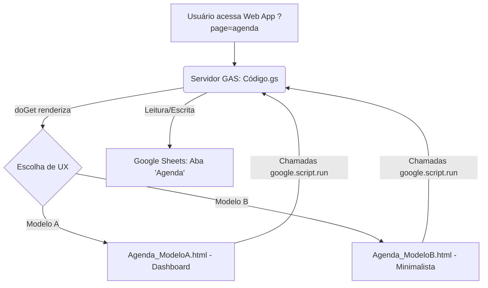

# Documento de Design: Portal de Cadastro & Agenda Pessoal (GAS)

Este documento detalha a arquitetura do Web App no Google Apps Script (GAS) contendo duas funcionalidades: o Portal de Cadastro original e a nova **Agenda Pessoal** (Nome e Telefone, sem menu).

Para suportar o desenvolvimento DevOps via CLASP, toda a estrutura de código será alocada na pasta `./src/`.

---

## 1. Arquitetura Geral
A aplicação funcionará como um Web App multi-páginas ou multi-módulos servido pelo GAS. 
- Para a nova funcionalidade de **Agenda Pessoal**, salvaremos os contatos em uma aba chamada `Agenda` no Google Sheets.
- Como o usuário solicitou que a tela de Agenda não tenha menu, ela será servida como um modelo independente (`Agenda_ModeloA.html` e `Agenda_ModeloB.html`).
- O desenvolvedor poderá alternar qual tela renderizar no `doGet()` ou através de parâmetros da URL (ex: `?page=agenda`).

---

## 2. Estrutura de Arquivos Proposta (Local `./src`)
- **`./src/Código.gs`**: Lógica de servidor (doGet, incluir, salvarFormulario, obterContatos, adicionarContato, removerContato).
- **`./src/Index.html`**: Tela original de cadastro.
- **`./src/Agenda_ModeloA.html`**: Proposta de layout de Agenda baseada no **Dashboard Moderno**.
- **`./src/Agenda_ModeloB.html`**: Proposta de layout de Agenda baseada na **Interface Minimalista**.

---

## 3. Especificação do Servidor (Backend - Código.gs)
Novas funções de suporte à Agenda Pessoal:

- **Modificação no `doGet(e)`**:
  - Aceitar parâmetro `e.parameter.page`. Se `e.parameter.page === 'agenda'`, renderizar o modelo de agenda escolhido pelo usuário (ou servir por padrão a variante A/B para testes).
- **`obterContatos()`**:
  - Abre a aba `Agenda`.
  - Retorna uma lista de objetos contendo `{ linha: número, nome: string, telefone: string }`.
- **`adicionarContato(contato)`**:
  - Recebe `{ nome: string, telefone: string }`.
  - Salva na planilha. Retorna `{ status: "success" }`.
- **`removerContato(linha)`**:
  - Exclui a linha correspondente na planilha. Retorna `{ status: "success" }`.

---

## 4. Propostas de UX (Agenda Pessoal)

### Opção A: "Dashboard Moderno" (Agenda_ModeloA.html)
- **Estrutura**: Sidebar lateral esquerda escura (`#1f2937`) fixa contendo o formulário de "Novo Contato" (campos de Nome e Telefone).
- **Conteúdo Principal**: Painel lateral claro (`#f4f7f6`) exibindo os contatos em uma tabela limpa e bem espaçada.
- **Elementos**: Cards de contato brancos com bordas arredondadas e sombras suaves, botão de deletar com ícone de lixeira vermelha.

### Opção B: "Interface Minimalista / Conversacional" (Agenda_ModeloB.html)
- **Estrutura**: Layout de coluna única centralizada (`max-width: 500px`), sem barras laterais. Header fixo e translúcido com desfoque de fundo.
- **Conteúdo Principal**: Campo de busca proeminente para filtragem dinâmica de contatos em tempo real. Os contatos são exibidos como cartões individuais contendo avatares circulares com as iniciais do nome.
- **Elementos**: Grande botão flutuante de "Adicionar" que abre um modal minimalista do Bootstrap para inserção de novos contatos.
